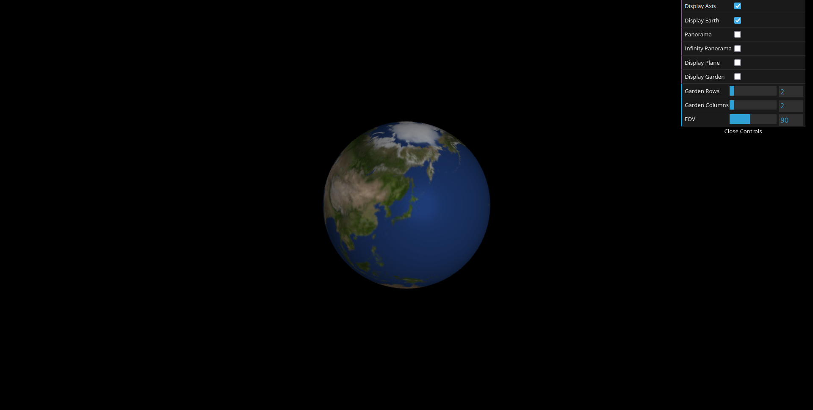
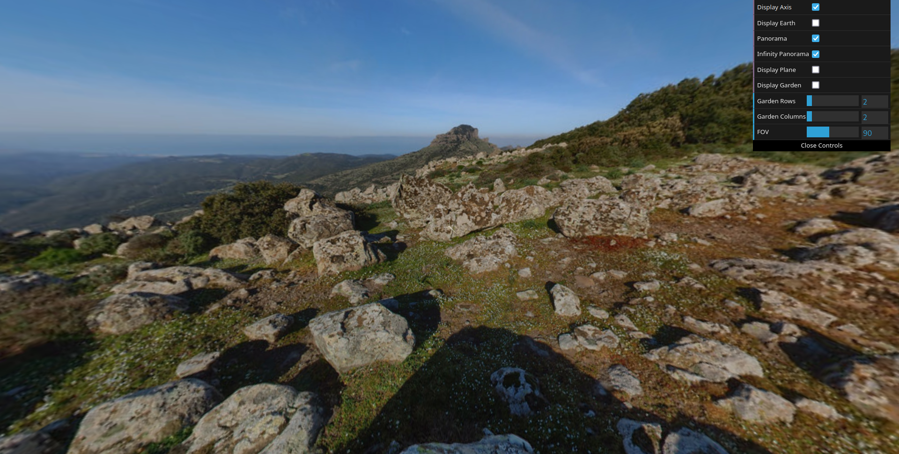
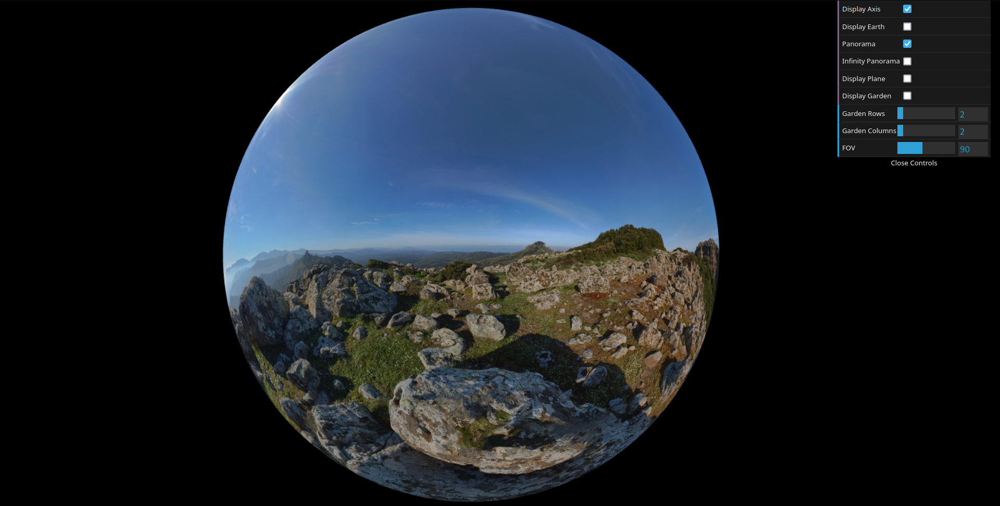
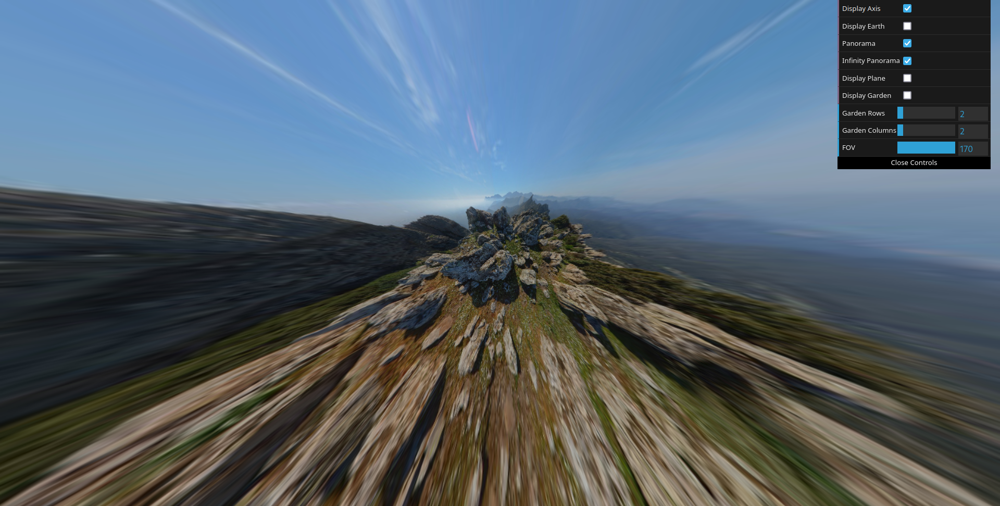

# CG 2023/2024

## Group T01G09 - Project Notes

### 1.1 - Criação de uma Esfera

- Escrever aqui alguma cena sobre a criação da esfera.

- Posteriormente, usando as classes `CGFappearance` e `CGFtexture`, tornou-se possível aplicar texturas à esfera, como é possível visualizar nas imagens.

 
**Figura 1: Esfera com textura de planeta terra**

### 1.2 - Adição de Panoramas

- Através da opção de aplicar texturas/cores pelo interior da esfera, criou-se uma instância desta figura geométrica com um raio de 200 unidades. Aplicando como textura uma imagem equirretangular, é possível criar a ilusão de "panorama".

- Posteriormente, criou-se também uma opção de "panorama infinito", em que o centro da esfera do panorama segue a posição da câmara.

 
**Figura 1: Panorama**

 
**Figura 2: Panorama infinito desativado - torna possível sair de dentro da esfera**

 
**Figura 3: Panorama com valor alto de FOV**

### 2 - Flores
