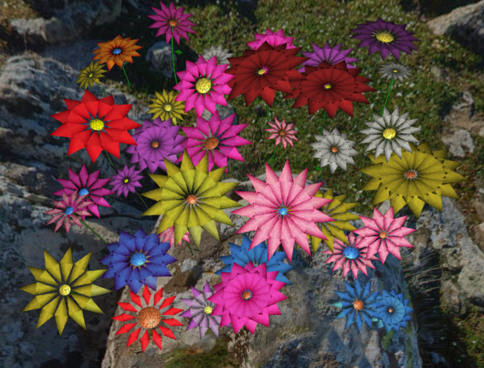

# CG 2023/2024

## Group T01G09 - Project Notes

### 1.1 - Criação de uma Esfera

- Através da definição individual de vértices e normais, foi criada a esfera.

- Posteriormente, usando as classes `CGFappearance` e `CGFtexture`, tornou-se possível aplicar texturas à esfera, como é possível visualizar nas imagens.

 
**Figura 1: Esfera com textura de planeta terra**

### 1.2 - Adição de Panoramas

- Através da opção de aplicar texturas/cores pelo interior da esfera, criou-se uma instância desta figura geométrica com um raio de 200 unidades. Aplicando como textura uma imagem equirretangular, é possível criar a ilusão de "panorama".

- Posteriormente, criou-se também uma opção de "panorama infinito", em que o centro da esfera do panorama segue a posição da câmara.

 
**Figura 1: Panorama**

 
**Figura 2: Panorama infinito desativado - torna possível sair de dentro da esfera**

 
**Figura 3: Panorama com valor alto de FOV**

### 2 - Flores

- Permitindo um elevado nível de personalização através da sua parametrização, as flores, e posteriormente, o jardim, apresentam um elevado grau de diversidade.

 
**Figura 4: Jardim**

 
**Figura 5: Caule curvo e folhas**

 
**Figura 6: Vista detalhada das pétalas e do núcleo d flor**

### 3 - Pedras e Penedos

- Utilizando como base o código da esfera, mas desorientando as normais, foi possível criar objetos semelhantes a pedras.

 
**Figura 7: Pequeno monte de pedras**

 
**Figura 8: Caule curvo e folhas**

### 4 - Abelha

- Utilizando apenas esferas e operações de escalamento, foi construída uma abelha.

- Esta abelha possui também um controlador que permite alterar a sua velocidade através das teclas `WASD`.

- Possui também um efeito "saltitante", segundo o eixo yy, bem como um bater de asas frequente, por forma a imitar o voo.

 
**Figura 9: Vista lateral a abelha**

 
**Figura 10: Vista frontal**

### 5 - Pólen e Colmeia

- Para dar vida à abelha, adicionamos "pólen" às flores e criámos uma colmeia.

- A abelha agora possui a funcionalidade de, ao aproximar-se de uma flor com pólen e premindo a tecla `F`, baixar a sua altitude à da flor, e apanhar o pólen. De seguida, podemos premir `P`, para voltar para a altitude inicial, ou `O`, para que a abelha se desloque autonomamente até à colmeia, onde irá largar o pólen.

 
**Figura 11: Colemeia e pólen**

 
**Figura 12: Abelha a transportar pólen**

 
**Figura 13: Pólen, largado pela abelha, no interior da colmeia**

### Shaders e Animação

- Para dar um novo nível de realismo a esta cena gráfica, criámos também um canteiro com relva.

- Esta relva é constituída por triângulos cada vez mais estreitos conforme sobe a folha, e conta com uma animação de "leve brisa", realizada através de shaders.

 
**Figura 14: Relva juntamente com o panorama da cena**

 
**Figura 15: Vista mais detalhada da relva**

 
**Figura 16: Vista aérea do efeito provocado pela animação da relva**
