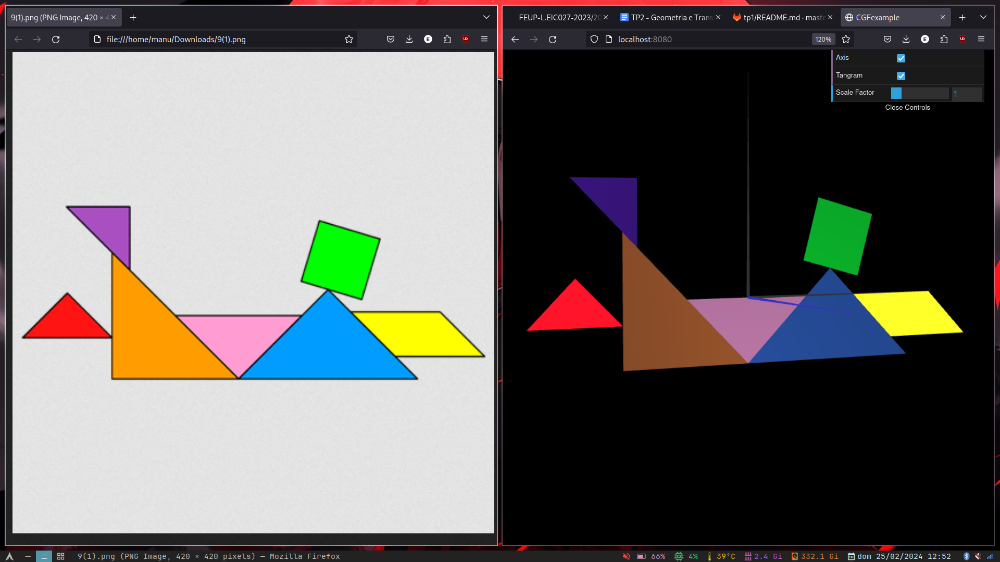

# CG 2023/2024

## Group T02G09

## TP 2 Notes (provisório)
- No exercício 2 aprendemos a usar a stack de matrizes, matrizes de escalamento, rotação e transformação. Aprendemos também a usar as funções vetoriais (`scene.rotate(ang, x, y, z)`, `scene.scale(x, y, z)` e `scene.translate(x, y, z)`). Aprendemos também a alterar a cor dos objetos usando a função `scene.setDiffuse();`
- 

**Figura 1: Reconstrução do Tangrama com a imagem original para comparação**

