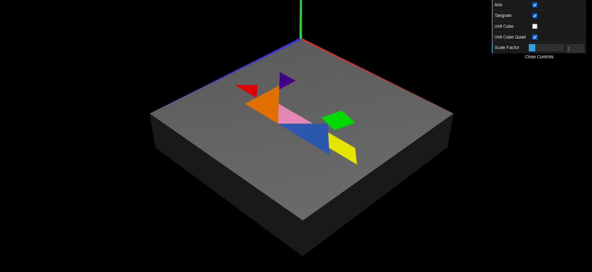

# CG 2023/2024

## Group T02G09

## TP 2 Notes
- No exercício 2 aprendemos a usar a stack de matrizes, matrizes de escalamento, rotação e transformação. Aprendemos também a usar as funções vetoriais (`scene.rotate(ang, x, y, z)`, `scene.scale(x, y, z)` e `scene.translate(x, y, z)`). Aprendemos também a alterar a cor dos objetos usando a função `scene.setDiffuse();`

**Figura 1: Reconstrução do Tangrama com a imagem original para comparação**

- No exercício 3 construímos um cubo unitário, definindo cada um dos seus 8 vértices e 12 triângulos. Utilizamos ainda as técnicas de transformação usadas anteriormente para posicionar e redimensionar o cubo de forma a servir de base para o Tangrama do exercício anterior.

**Figura 2: Tangrama anterior com cubo redimensionado a servir de base**

- No exercício 4 refizemos o cubo unitáro, desta vez construindo-o utilizando as 6 faces como peça, sendo cada uma um quadrado criado à parte. Voltamos também a redimensionar o cubo.

**Figura 3: Tangrama anterior com o novo cubo redimensionado para servir de base**
