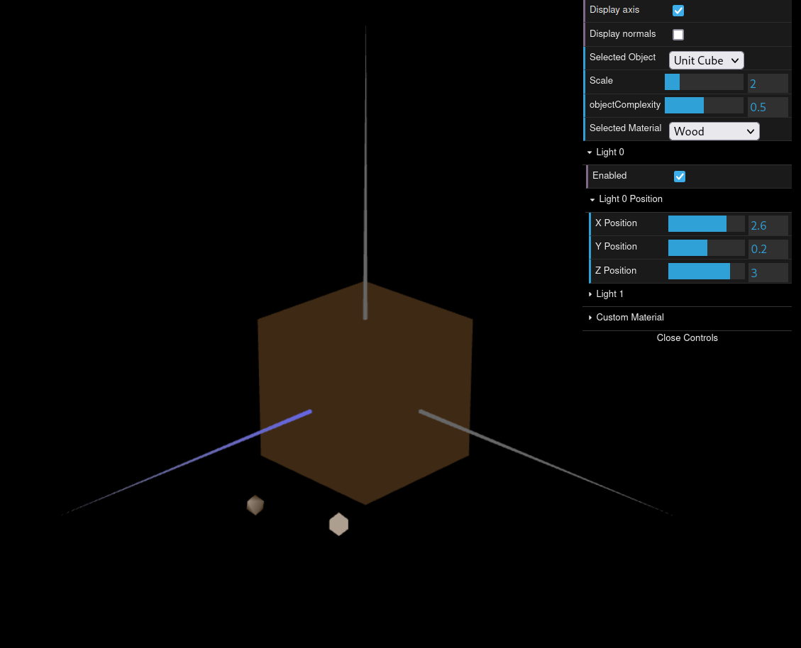
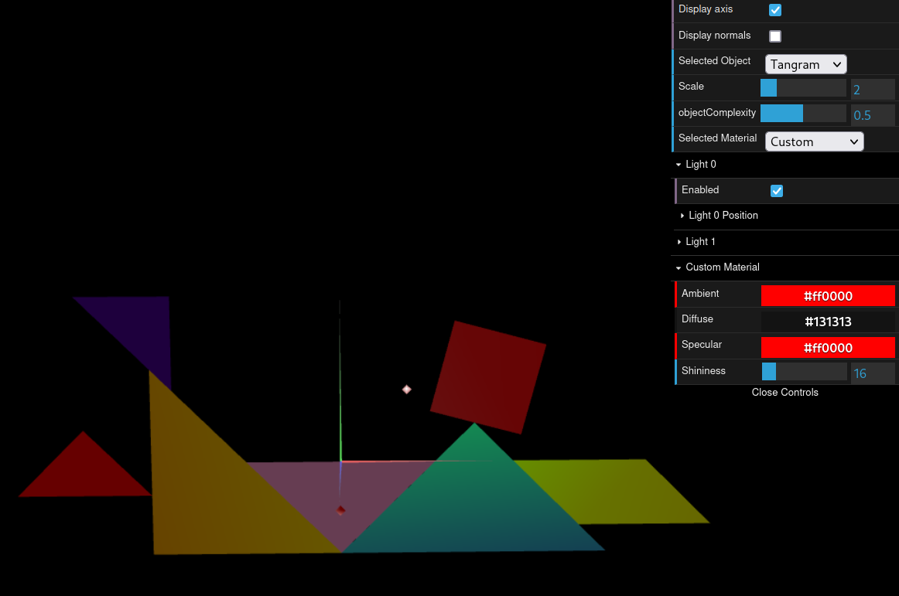
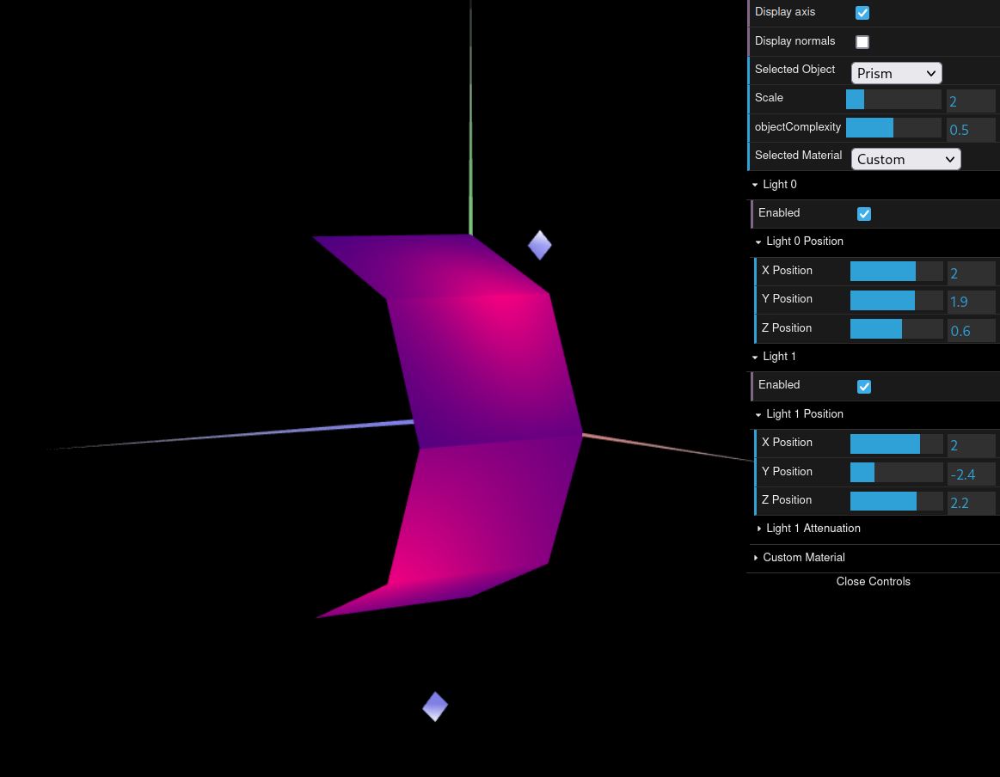
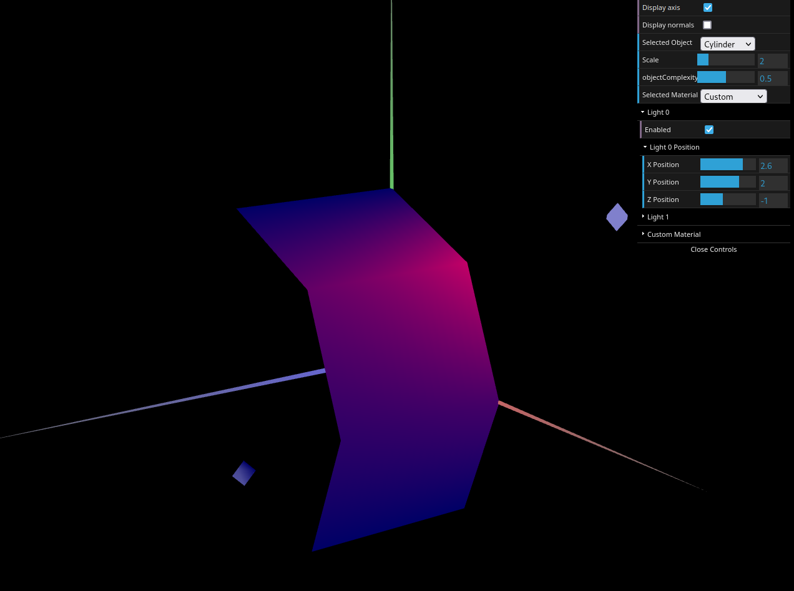

# CG 2023/2024

## Group T02G09

## TP 3 Notes

### Exercício 1
- No primeiro exercício, começamos por definir as normais para o objeto `MyUnitCube`, o que permitiu o funcionamento correto da iluminação. De seguida, definimos um material com cor similar à da madeira (castanho), e aplicamo-lo ao `MyUnitCube`.

 
**Figura 1: Unit Cube com cor similar à da madeira**

- Na segunda parte do primeiro exercício, criamos ainda novos materiais com alta componente especular, para colorir a figura `MyTangram`. A figura `MyDiamond` utiliza o `customMaterial`, o que permite que o utilizador altere dinamicamente as suas propriedades.

 
**Figura 2: Tangrama colorido com material dinâmico no Diamante**

### Exercício 2
- No segundo exercício, construímos um prisma com um número variável de "lados" e "andares", o que permite variar o nível de complexidade da figura. A iluminação, neste caso, assemelha-se ao efeito obtido com *Constant Shading* devido à orientação fixa das normais relativamente às faces do prisma.

 
**Figura 3: Prisma com 8 lados e 20 andares, num total de largura de uma unidade**

### Exercício 3
- Neste exercício tivemos como base o código do exercício anterior, modificando-o, em primeiro as normais, fazendo com que estas ficassem paralelas à superfície do cilindro. Na segunda parte do exercício, procuramos otimizar a renderização da figura, removendo vértices desnecessários. Esta metodologia permite suavizar as transições de iluminação nas arestas, dando uma aparência curva à superfície, o que se pode confirmar através da captura de ecrã apresentada.

 
**Figura 4: Demosntração de metodologia para suavização da iluminação aplicada ao cilindro**

