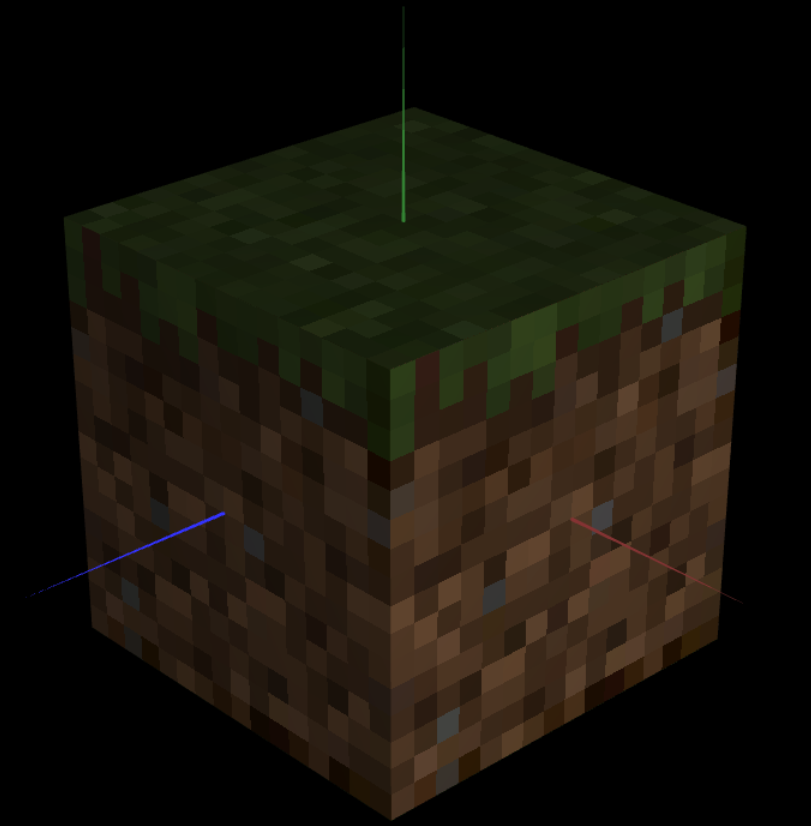

# CG 2023/2024

## Group T02G09

## TP 4 Notes

### Exercício 1
- No primeiro exercício, aprendemos a mapear texturas a diferentes figuras, definindo as coordenadas para cada vértice. Neste caso, usamos as texturas correspondentes a cada peça do tangrama, presentes no ficheiro `tangram.png` e usando a imagem `tangram-lines.png` como guia, o que provou ser crucial para garantir a orientação correta das texturas.

 
**Figura 1: Tangrama com as texturas de `tangram.png` aplicadas**

### Exercício 2
- No segundo exercício, foi-nos colocado o desafio de aplicar texturas a todos os lados do `MyUnitCubeQuad`. No início, uma vez que as texturas têm uma resolução menor que o tamanho das faces do quadrado, e que por definição, existe uma interpolação linear das cores, estas ficaram desfocadas, tendo sido necessário alterar o tipo de filtragem para que ficassem bem difinidas.

 
**Figura 2: Cubo com texturas nítidas**

