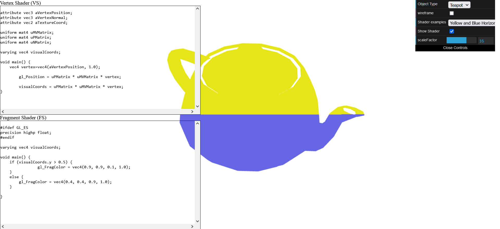
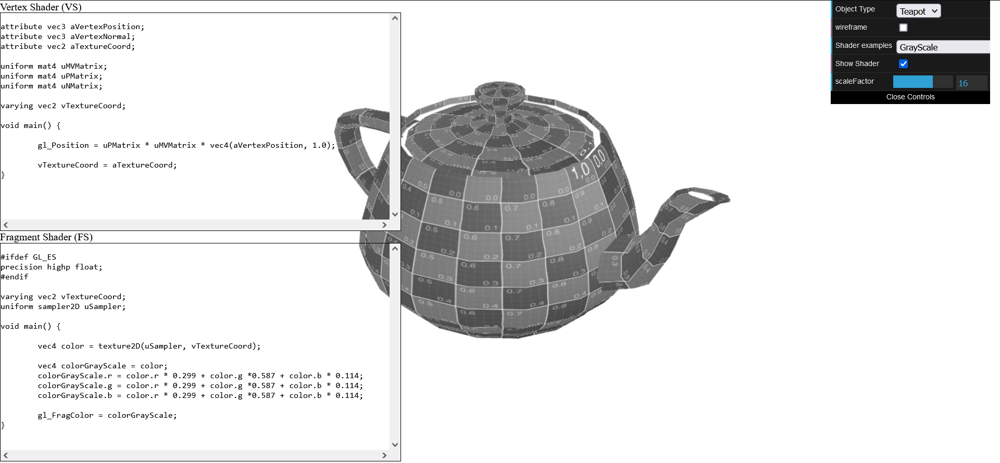

# CG 2023/2024

## Group T02G09

## TP 5 Notes

### Exercício 1
- No primeiro exercício, aprendemos a modificar shaders de forma a produzir vários efeitos num objecto.
- Aprendemos a modificar texturas de forma a alterar a cor das texturas (exercício 1.3), como exemplificado na figura 2 em que alteramos a textura para se apresentar em tons de cinza.
- Aprendemos a alterar animações de forma a produzir os movimentos que desejamos dos shaders (exercicio 1.2).
- Aprendemos a criar novos shaders e a passar variáveis de coordenadas para animar o movimento de texturas num objecto (exercicio 1.1), como exemplificado na figura 1 em que definimos a cor a utilizar (amarelo ou azul) dependendo do angulo em que o utilizador vê o objecto, de forma a que o amarelo esteja sempre em cima do azul.

 
**Figura 1: Bule de Chá com horizonte amarelo e azul dependente do ponto de vista**

 
**Figura 2: Blue de Chá com textura em tons de cinza**

### Exercício 2
- 

 
**Figura 3: -**

